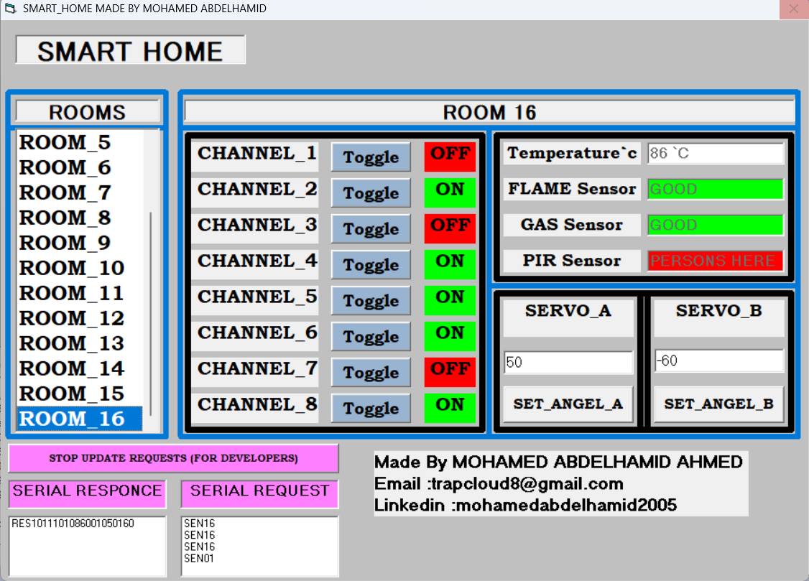
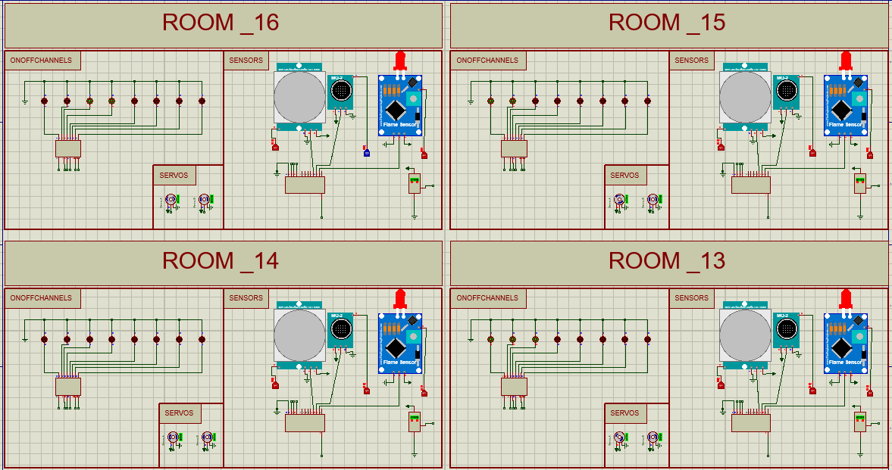
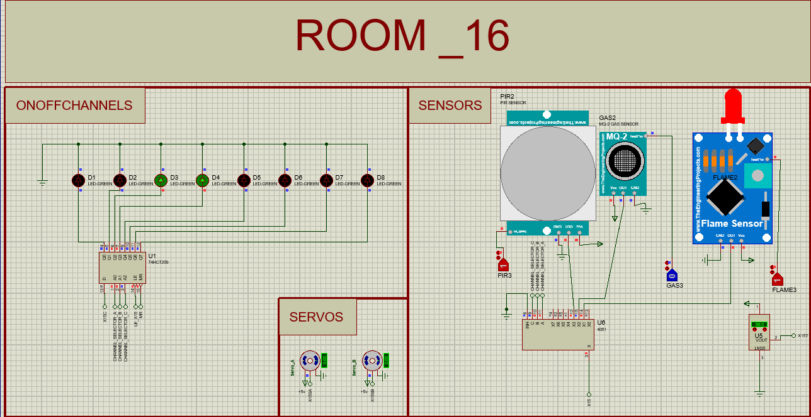
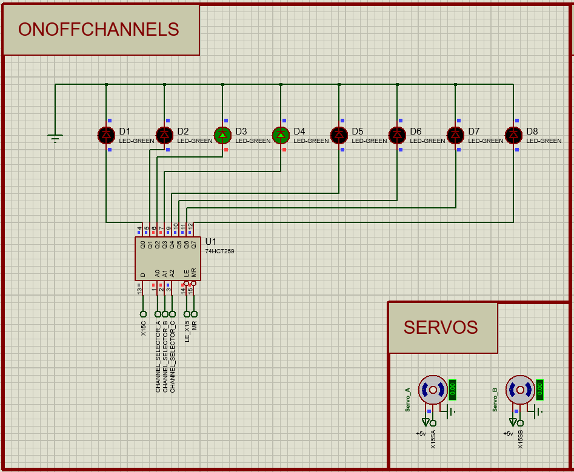
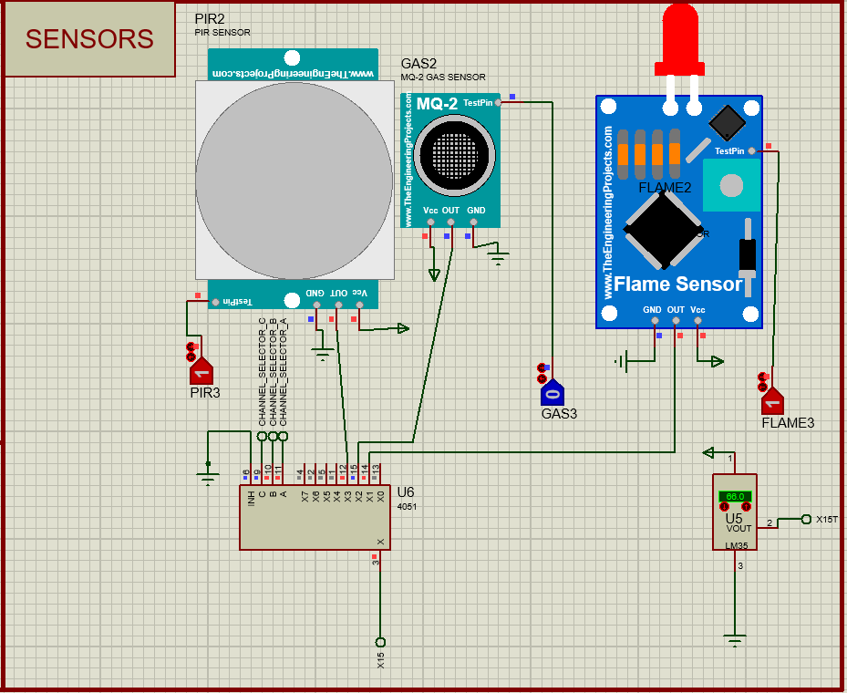
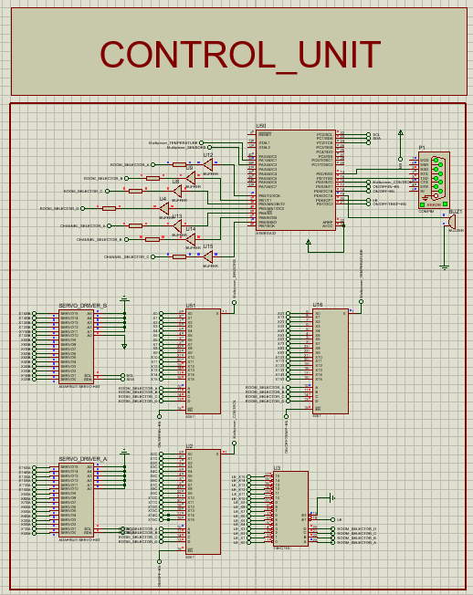
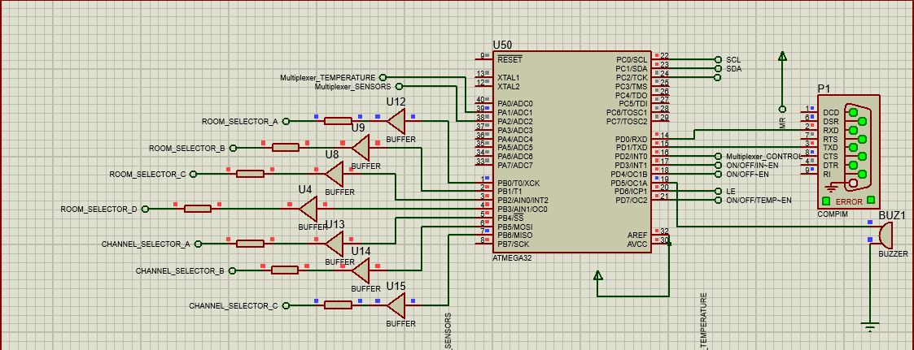
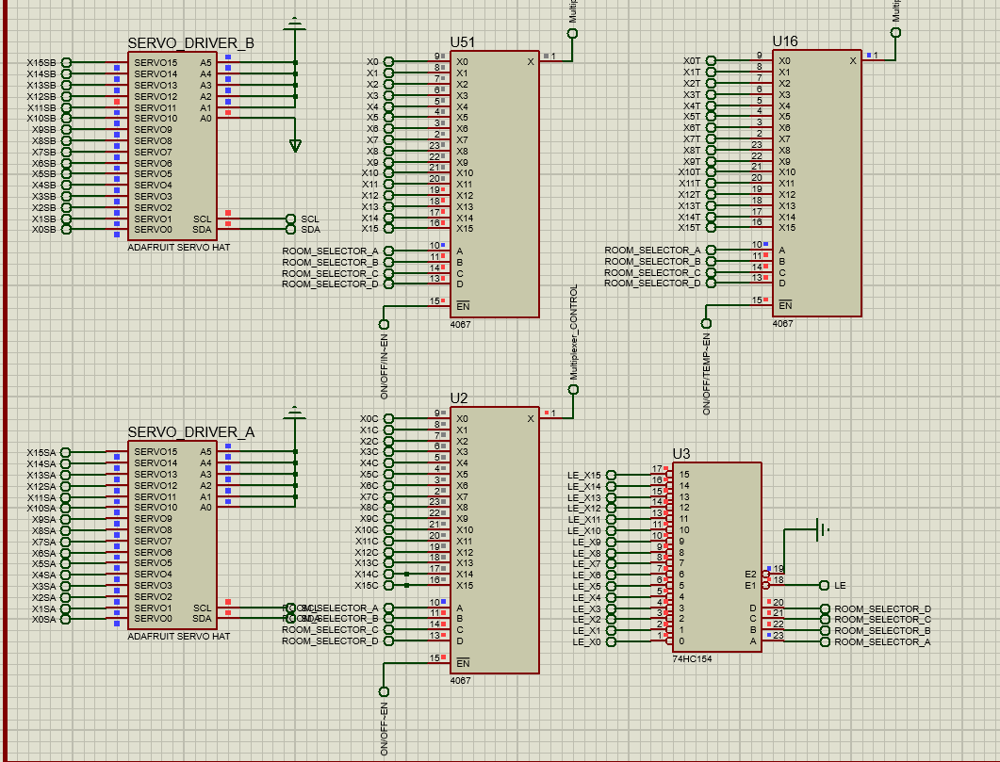

# 🏠 224 Channels Smart Home


## 📌 Overview
The **224 Channels Smart Home** is a large-scale automation system that integrates **16 rooms**, each with **14 channels** (8 ON/OFF, 2 PWM servo, 4 sensors: Temperature, PIR, Gas, Flame). 
A **VB6 desktop application** provides full PC-based control and monitoring via UART.

## ✨ Features
- **224 total channels** across 16 rooms (16 × 14).
- Per room:
  - 🔌 **8 ON/OFF channels** (relays).
  - ⚙️ **2 PWM servo channels** (curtains/locks/mechanisms).
  - 🌡️ **4 sensors**: Temperature, PIR, Gas, Flame.
- 🖥️ **VB6 PC control**: real-time GUI, UART communications, status & alerts.
- 🔐 Safety alerts for gas/fire/intrusion.
- ⏱️ Scheduling & automation scenarios.
- 📊 Optional data logging.

## 🛠️ Hardware (from Schematic / ERC)
This list is **auto-derived from your Proteus ERC output** and reflects the main blocks present in the uploaded schematic.

### Core Control
- **U50 — Main MCU** (pins observed: `PD0/RXD`, `AREF`, `VCC`, `GND`, `PB3/MOSI/OC2A`, `PB5/SCK`).
  - Handles room/channel selection, sensor reading, and UART with the PC.
- **P1 — PC Serial Header / Connector** (signals: `RXD`, `RTS`, `DTR`).

### Servo Drive
- **SERVO_DRIVER_A**, **SERVO_DRIVER_B** — dedicated servo driver blocks.
- **MOTOR-PWMSERVO#0023, #0037, #0086, #008A** — individual PWM servo instances (IDs from schematic).

### Sensor Banks (per groups/rooms)
- **PIR1..PIR4** — Passive Infrared motion sensors.  
  - `PIR3.Q0`, `PIR4.Q0` appear as outputs in logic grouping.
- **GAS1..GAS4** — Gas sensors (MQ‑type expected).
  - `GAS3.Q0`, `GAS4.Q0` appear as outputs.
- **FLAME1..FLAME4** — Flame sensors.
  - `FLAME3.Q0`, `FLAME4.Q0` appear as outputs.
- **Temperature** sensors are part of the per-room spec (not explicitly named in ERC lines but included in system design).

### Logic / Power ICs (naming from schematic references)
> The ERC shows several logic/power blocks tied to VDD/VSS or VCC/GND rails, likely **decoders, latches, expanders, or multiplexers** used to fan-out control to 16 rooms × 14 channels.
- **U1, U3, U7** — VCC/GND devices (likely logic drivers/multiplexers/latches).
- **U11, U16, U6, U51, U2** — VDD/VSS devices (likely CMOS logic expanders/decoders).
- **U5, U10** — devices with `+VS/-VS` pins (dual-rail analog/driver ICs or supply modules).

### Power & Rails
- **VCC / VDD** rails and **GND / VSS** returns clearly present.
- **AREF** used on MCU for ADC reference.

### Control / Timing Nets (from labels)
Channel selection and strobing nets that coordinate room/channel addressing and latch/enable timings:
- `X0..X13`, `X0C..X13C` — channel select / column nets.
- `X0SA..X13SA`, `X0SB..X13SB` — select/side-A/B nets (likely sensor/actuator banks).
- `LE_X0..LE_X13` — **Latch Enable** lines.
- `X0T..X13T` — timing/trigger nets.

> These names strongly suggest a **matrix addressing** approach (e.g., multiplexing channels and then latching outputs per room), matching the project’s scalability.

## 💻 Software & Tools
- **VB6 Desktop Application** for GUI control and visualization.
- **Firmware**: Embedded C/AVR-GCC or Arduino toolchain.
- **Comms**: UART (PC ↔ MCU).
- Optional: MQTT/HTTP bridge, database logging.

## 📂 Repository Structure
```
224-Channels-Smart-Home/
│── firmware/           # Microcontroller source / HEX
│── vb6_app/            # VB6 program (forms, modules)
│── hardware/           # Proteus schematic/PCB files
│   └── NTI_SMARTHOME.pdsprj
│── docs/               # Diagrams, manuals, BOM
│── screenshots/        # GUI & wiring images
│── LICENSE.txt         # MIT License
│── README.md
```

## 🚀 How It Works
1. **VB6 app** sends commands (UART) to MCU to select room/channel and action.
2. **MCU** decodes selection, latches outputs for ON/OFF, generates PWM for servos.
3. **Sensors** are scanned and their states/values returned to the PC.
4. **Alerts** (gas/flame/motion) propagate immediately to the GUI.

## ✅ ERC Summary (from your run)
- **Source**: `NTI_SMARTHOME.pdsprj`  
- **Created**: 2025‑08‑12 — **Modified**: 2025‑08‑21  
- **Status**: *ERC errors found* (mostly connectivity/pin‑type issues).

### Notable Items To Review
- **P1.RXD (Output)** ↔ **U50.PD0/RXD (I/O)** — verify PC↔MCU RX/TX orientation and level shifting.
- **P1.RTS / P1.DTR** — flagged **UNDRIVEN**; either drive or remove from net.
- Multiple warnings: sensor nets (`PIRx`, `GASx`, `FLAMEx`) tied to **GND/VSS/VCC** and shared with many device pins — check net labels/shorts.
- **AREF** tied to VCC through multiple paths — confirm ADC reference design.
- Large set of **singular labels** (`X*`, `LE_X*`, etc.) — ensure each label connects to at least two nodes.
- Devices with `+VS/-VS` (U5, U10) — confirm intended supply rails.

> Action: run **Tools → Electrical Rules Check** after fixing labels and verify that sensor outputs are **not shorted** to power rails and that UART lines are cross-connected correctly (PC‑TX → MCU‑RX, PC‑RX → MCU‑TX).

## 📸 Screenshots & Diagrams









## 👨‍💻 Author
- NAME : MOHAMED ABDELHAMID AHMED ALI
- EMAIL : trapcloud8@gmail.com
- LinkedIn : [Mohamed Abdelhamid](https://www.linkedin.com/in/mohamedabdelhamid2005/)
